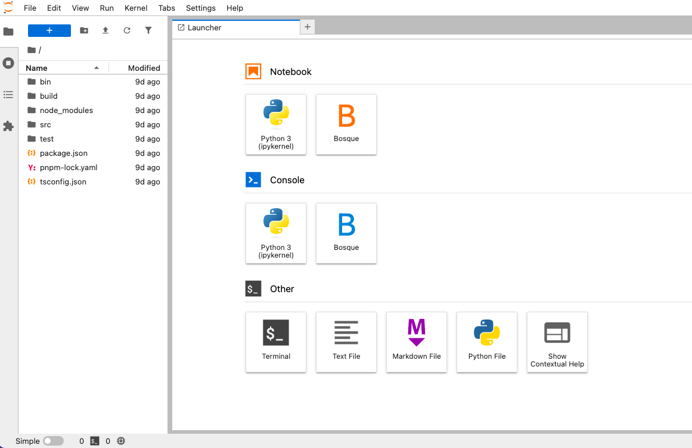
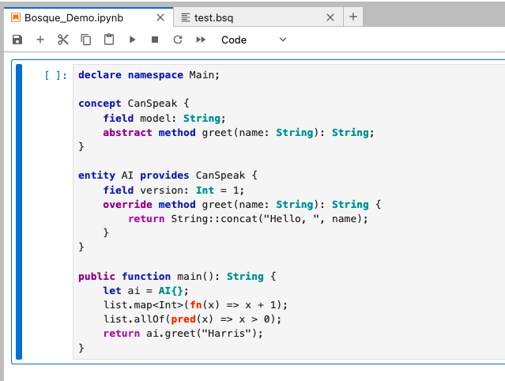
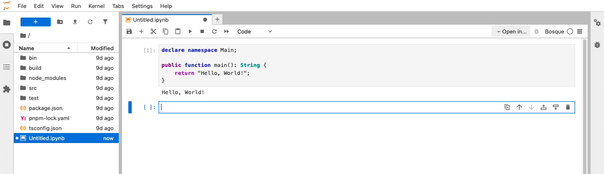
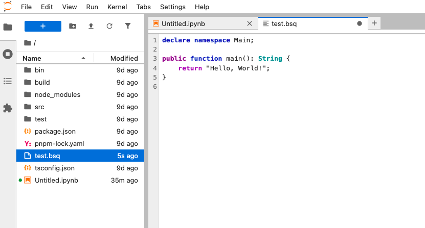
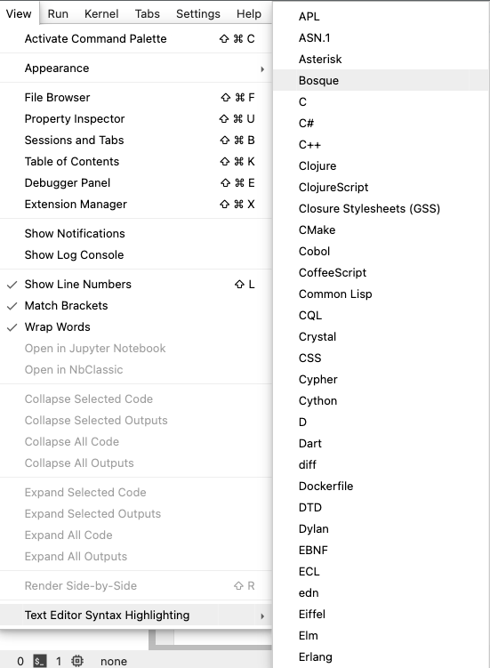

# BosqueDev-Jupyter

A Jupyter Lab 4.x environment with integrated Bosque programming language support.



## Features

- Complete Jupyter Lab 4.x environment
- Integrated Bosque language support:
  - [Jupyter kernel for code execution](https://github.com/brakmic/jupyterlab_bosque_kernel)
  - [Syntax highlighting extension](https://github.com/brakmic/jupyterlab-bosque-syntax)
- Pre-installed development tools:
  - Node.js 22.x
  - Git & Git LFS
  - nano editor with syntax highlighting
  - TypeScript support
  - pnpm package manager

## Screenshots



*Syntax Highlighting* based on [Lezer Grammar](https://lezer.codemirror.net/)



*Code Compilation and Execution*



*Bosque File Support*



*Text Editor Syntax Highlighting*

## Usage

Run the pre-built image:

```bash
docker run -p 8888:8888 brakmic/bosquedev-jupyter
```

Or build from Dockerfile:

```bash
docker build -t bosquedev-jupyter -f Dockerfile .
docker run -p 8888:8888 bosquedev-jupyter
```

## Components

- Base Images:
  - brakmic/bosquedev:latest (Stage 1)
  - quay.io/jupyter/base-notebook:latest (Stage 2)
- Extensions:
  - Bosque Jupyter Kernel
  - Bosque Syntax Highlighting

## Learn More About Bosque

### Resources

- [Bosque Language Project](https://github.com/BosqueLanguage/)
- [Bosque Language Blog](https://bosquelanguage.github.io/)
- [Bosque Language Page (Unofficial)](https://bosque-lang.org)

### Papers

- [Toward Programming Languages for Reasoning –
Humans, Symbolic Systems, and AI Agents](https://www.arxiv.org/pdf/2407.06356)
- [Regularized Programming with the Bosque Language](https://www.microsoft.com/en-us/research/uploads/prod/2019/04/beyond_structured_report_v2.pdf)
- [A Programming Language for Data and Configuration](https://github.com/BosqueLanguage/BSQON/blob/main/docs/publications/bsqon_techreport.pdf)

# License

[MIT](./LICENSE)
